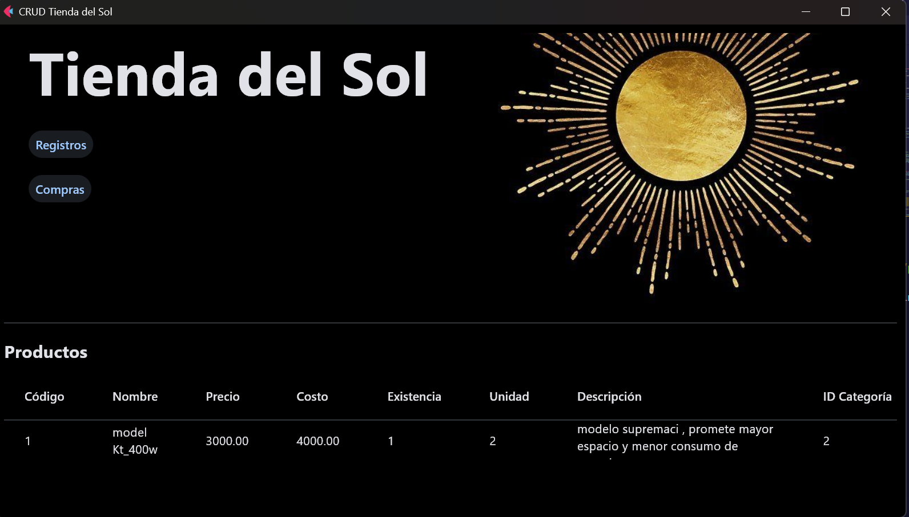

# Tienda-del-Sol

1.-Primero que nada se debe cambiar la ruta
donde se encuentra las imagenes del proyecto en el archivo 
"interfz.py" en la linea 168

2.-instalacion de flet 
    con comandos como:
    pip install flet

3.-instalar mysql conecto
    pip install MySQL-conector

4.-Crear la base de datos mysql "tiendadelsol" con el archivo
"tiendasol.sql" que contiene la base de datos 

5.-probarlo
    debera mostrar algo asi:
    si se tiene correcto la base de datos y las rutas
    

    

